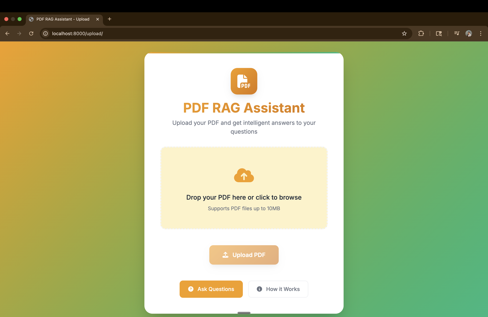
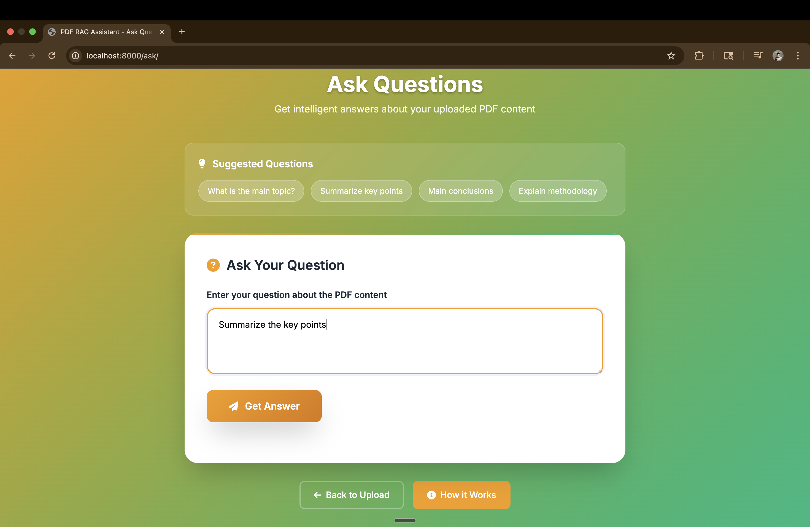
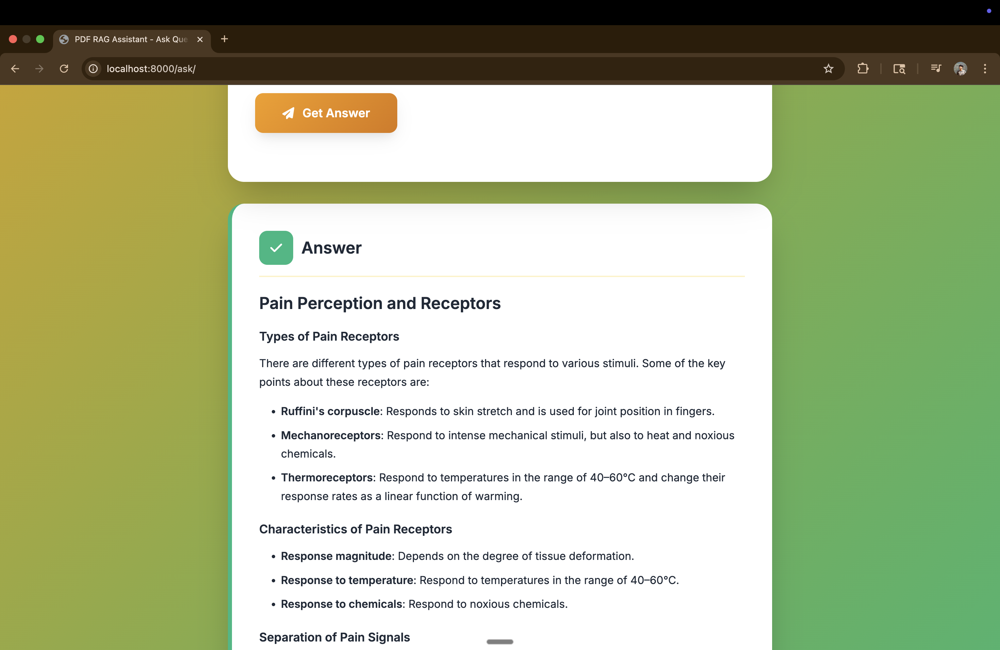
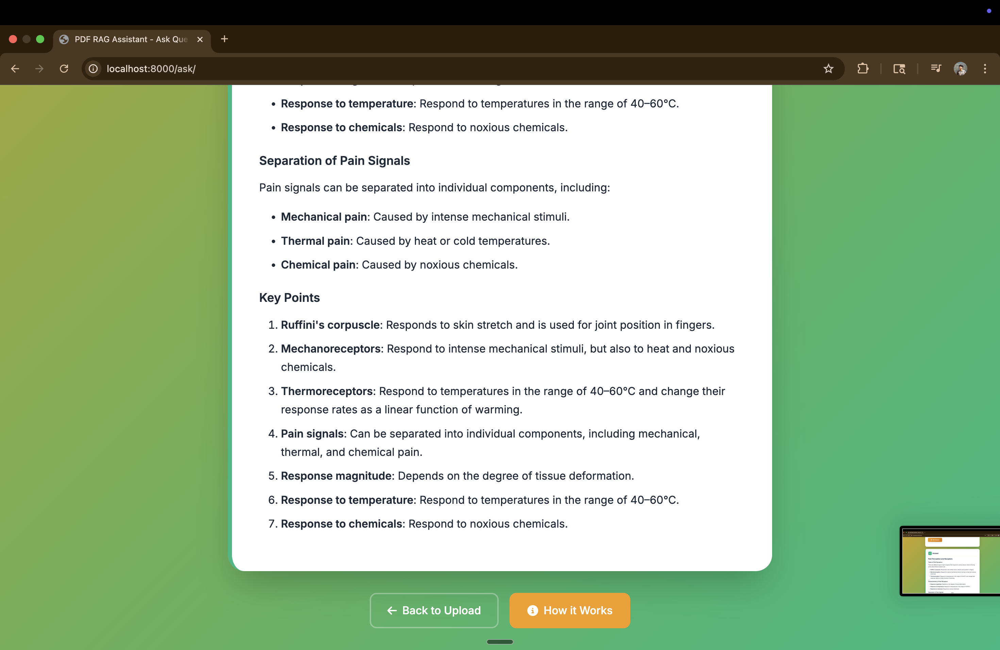
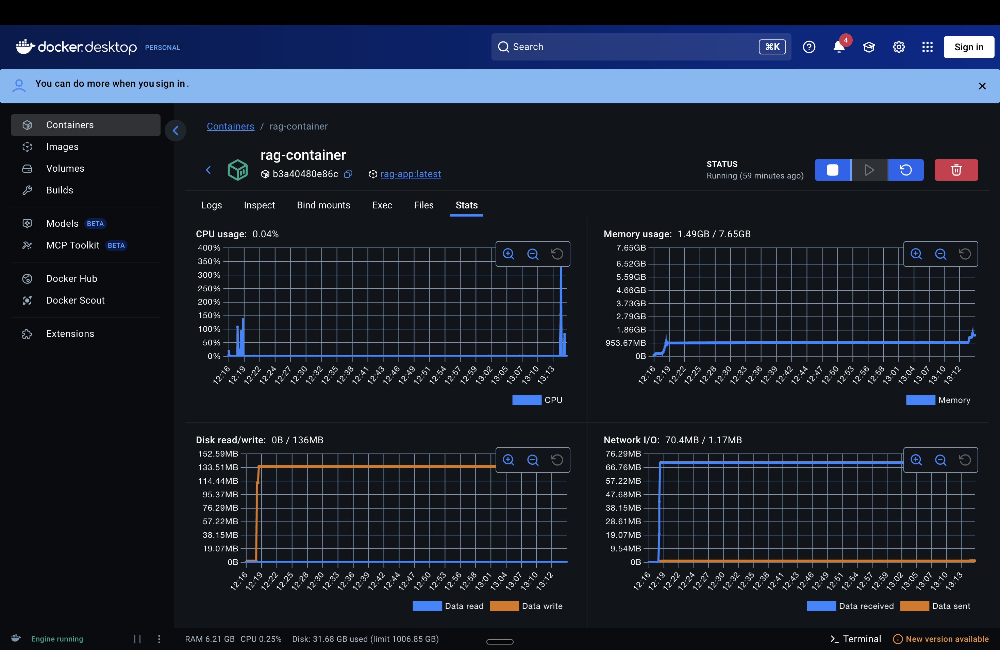

# RAG Production System

## Project Overview

The RAG Production System is a sophisticated Retrieval-Augmented Generation application built with Django that enables users to upload PDF documents and ask intelligent questions about their content. The system leverages advanced AI technologies including Groq's LLM, vector embeddings, and Qdrant vector database to provide accurate, context-aware responses.

## Screenshots

### 1. Main Dashboard

*The main dashboard showing the RAG system overview and navigation options.*

### 2. PDF Upload Interface

*Modern drag-and-drop interface for uploading PDF documents with progress tracking.*

### 3. Question Answering Interface

*Interactive interface for asking questions about uploaded PDFs with AI-generated responses.*

### 4. Admin Panel

*Comprehensive Django admin interface for managing PDFs, queries, and system data.*

### 5. System Architecture

*Visual representation of the RAG system architecture and data flow.*

## Key Features

- **PDF Document Processing**: Advanced PDF text extraction and chunking
- **AI-Powered Q&A**: Intelligent question answering using Groq's LLama 3.1 model
- **Vector Search**: Fast semantic search using Qdrant vector database
- **Modern UI/UX**: Beautiful, responsive interface with drag-and-drop functionality
- **Docker Ready**: Production-ready containerization with Docker
- **Admin Interface**: Comprehensive Django admin for system management
- **Test Coverage**: Extensive test suite for quality assurance

## Architecture

The system follows a modern, scalable architecture:

```
┌─────────────────┐    ┌──────────────────┐    ┌─────────────────┐
│   Django Web    │    │   Qdrant Vector  │    │   Groq LLM      │
│   Application   │◄──►│   Database       │    │   API Service   │
└─────────────────┘    └──────────────────┘    └─────────────────┘
         │
         ▼
┌─────────────────┐
│   FastEmbed     │
│   Embeddings    │
└─────────────────┘
```

## Technology Stack

### Backend Framework
- **Django 5.2.3**: Modern Python web framework
- **Gunicorn**: Production-grade WSGI HTTP server

### AI & Machine Learning
- **LangChain**: Framework for building LLM applications
- **Groq LLM**: Fast inference with Llama 3.1-8b-instant model
- **FastEmbed**: Efficient text embedding generation
- **TikToken**: Fast BPE tokenizer for text processing

### Vector Database
- **Qdrant**: High-performance vector similarity search engine

### Document Processing
- **PyPDF2**: Pure Python PDF library for text extraction

### Infrastructure
- **Docker**: Containerization for consistent deployment
- **SQLite**: Lightweight database for development and testing

## Quick Start

### Prerequisites
- Docker and Docker Compose installed
- Groq API key (get one at [groq.com](https://groq.com))
- Qdrant API key (optional for local development)

### One-Command Setup
```bash
# Clone and setup in one go
git clone <your-repository-url>
cd rag-prod
chmod +x setup.sh
./setup.sh setup
```

The setup script will automatically:
- Check Docker installation
- Create environment configuration
- Set up necessary directories
- Start all services automatically
- Verify system health

### Manual Setup

#### 1. Clone the Repository
```bash
git clone <your-repository-url>
cd rag-prod
```

#### 2. Set Environment Variables
Copy the example environment file and configure it:
```bash
# Copy the example environment file
cp .env.example .env

# Edit the .env file with your actual values
nano .env  # or use your preferred editor
```

**Required Environment Variables:**
```bash
GROQ_API_KEY=your_groq_api_key_here
QDRANT_API_KEY=your_qdrant_api_key_here
QDRANT_URL=http://qdrant-container:6333
```

#### 3. Start the Application

**Option 1: Quick Setup (Recommended)**
```bash
# Make setup script executable and run it
chmod +x setup.sh
./setup.sh setup
```

**Option 2: Manual Setup**
```bash
# Create Docker network
docker network create rag-network

# Start Qdrant vector database
docker run -d -p 6333:6333 --name qdrant-container --network rag-network qdrant/qdrant:latest

# Build and run the RAG application
docker build -t rag-app .
docker run -d --name rag-container --network rag-network -p 8000:8000 \
  -e GROQ_API_KEY="your_groq_api_key" \
  -e QDRANT_API_KEY="your_qdrant_api_key" \
  -e QDRANT_URL="http://qdrant-container:6333" \
  rag-app

# Apply database migrations
docker exec rag-container python manage.py migrate
```

**Option 3: Docker Compose**
```bash
# Start all services with Docker Compose
docker-compose up -d

# Check service status
docker-compose ps
```

#### 4. Access the Application
Open your browser and navigate to: `http://localhost:8000`

## Project Structure

```
rag-prod/
├── README.md                 # Project documentation
├── DEPLOYMENT.md             # Deployment guide
├── docker-compose.yml        # Production deployment orchestration
├── requirements.txt          # Python dependencies
├── Dockerfile               # Container build configuration
├── gunicorn.conf.py         # Production server configuration
├── manage.py                # Django management script
├── .env.example             # Environment variables template
├── setup.sh                 # Quick setup and management script
├── screenshots/             # Application screenshots and visual documentation
├── rag/                     # Django project package
│   ├── settings.py          # Framework configuration
│   ├── urls.py              # URL routing configuration
│   ├── wsgi.py              # WSGI application entry point
│   └── asgi.py              # ASGI application entry point
├── retrival/                # Core RAG application
│   ├── models.py            # Database models and relationships
│   ├── views.py             # Business logic and request handling
│   ├── forms.py             # User input validation and forms
│   ├── urls.py              # App-specific URL routing
│   ├── admin.py             # Django admin interface configuration
│   ├── apps.py              # Application configuration
│   ├── tests.py             # Comprehensive test suite
│   └── templates/           # HTML templates
│       ├── upload.html      # PDF upload interface
│       └── ask_question.html # Question answering interface
└── .gitignore               # Git ignore patterns
```

## Configuration

### Quick Setup Script
The `setup.sh` script provides easy management of your RAG system:

```bash
# Complete setup and start
./setup.sh setup

# Start services
./setup.sh start

# Stop services
./setup.sh stop

# View logs
./setup.sh logs

# Check status
./setup.sh status

# Show help
./setup.sh help
```

### Django Settings
The application is configured through `rag/settings.py` with optimized settings for:
- Database configuration (SQLite for development)
- Static file handling
- Security middleware
- Session management
- Internationalization

### Gunicorn Configuration
Production server settings in `gunicorn.conf.py`:
- Worker process optimization
- Timeout configurations (120s for RAG operations)
- Logging and monitoring
- Process management

### Docker Configuration
- Multi-stage build for optimization
- Environment variable management
- Network configuration for inter-container communication
- Volume mounting for persistent data

## Usage Guide

### 1. Upload PDF Documents
1. Navigate to the upload page (`/upload/`)
2. Drag and drop or select a PDF file
3. Wait for processing completion
4. View upload confirmation

### 2. Ask Questions
1. Go to the question page (`/ask/`)
2. Type your question about the uploaded PDF
3. Receive AI-generated response based on document content
4. Ask follow-up questions as needed

### 3. Admin Interface
1. Access `/admin/` with superuser credentials
2. Manage uploaded PDFs and user queries
3. Monitor system usage and performance
4. View detailed analytics and logs

## Testing

Run the comprehensive test suite:
```bash
# Run all tests
docker exec rag-container python manage.py test

# Run specific test classes
docker exec rag-container python manage.py test retrival.tests.UploadedPDFModelTest

# Run with coverage
docker exec rag-container python manage.py test --verbosity=2
```

## Performance Optimization

### Gunicorn Worker Configuration
- **Workers**: `(2 × CPU cores) + 1` for optimal performance
- **Timeout**: 120 seconds for RAG operations
- **Max Requests**: 1000 per worker to prevent memory leaks
- **Preload App**: Enabled for faster startup

### Vector Database Optimization
- **Qdrant**: Optimized for high-throughput vector operations
- **Embedding Generation**: FastEmbed for efficient text processing
- **Chunking Strategy**: Recursive character splitting for optimal retrieval

## Security Features

- **CSRF Protection**: Built-in Django CSRF middleware
- **File Validation**: Comprehensive PDF file type and size validation
- **Session Security**: Secure session management and storage
- **Input Sanitization**: Form validation and data cleaning
- **Admin Authentication**: Secure admin interface access

## Deployment

### Production Considerations
1. **Environment Variables**: Use secure environment variable management
2. **Database**: Consider PostgreSQL for production workloads
3. **Static Files**: Configure CDN for static asset delivery
4. **Monitoring**: Implement application performance monitoring
5. **Backup**: Regular database and file backups
6. **SSL/TLS**: Enable HTTPS for production deployments

### Scaling Strategies
- **Horizontal Scaling**: Multiple application instances behind load balancer
- **Database Scaling**: Qdrant clustering for high availability
- **Caching**: Redis for session and query caching
- **CDN**: Content delivery network for global performance

## Contributing

1. Fork the repository
2. Create a feature branch (`git checkout -b feature/amazing-feature`)
3. Commit your changes (`git commit -m 'Add amazing feature'`)
4. Push to the branch (`git push origin feature/amazing-feature`)
5. Open a Pull Request

## License

This project is licensed under the MIT License - see the [LICENSE](LICENSE) file for details.

## Author

**Your Name** - [your-email@example.com](mailto:your-email@example.com)

## Acknowledgments

- **Django Team**: For the excellent web framework
- **Groq**: For fast and efficient LLM inference
- **Qdrant**: For high-performance vector search
- **LangChain**: For the RAG framework and integrations
- **Open Source Community**: For the amazing tools and libraries

## Support

For support and questions:
- **Email**: [your-email@example.com](mailto:your-email@example.com)
- **GitHub Issues**: Report bugs and request features
- **Documentation**: [Project Wiki](https://github.com/yourusername/your-repo/wiki)

---

**Made with dedication and expertise by [Your Name]**

*Last updated: December 2024*
